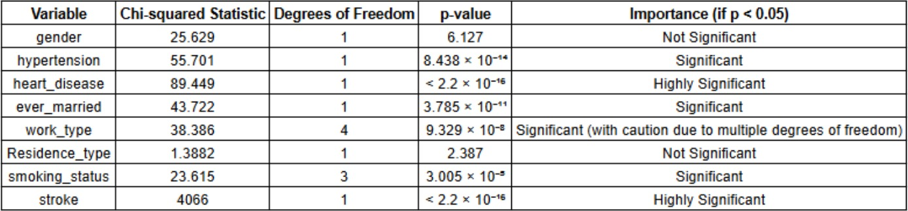

```{r setup, include=FALSE}
knitr::opts_chunk$set(echo = TRUE)
```

**Aldo Oktavianus - 2702234081**

**Arieldhipta Tarliman - 2702234636**

**William - 2702225373**

```{r}
library(rjags)
library(coda)
library(dplyr)
library(ggplot2)
library(corrplot)
library(tidyr)
library(smotefamily)
library(corrplot)
set.seed(42)
# Pararel speed up R Model
library(doParallel)
library(loo)
library(ggplot2)

cl <- makePSOCKcluster(5)
registerDoParallel(cl)
```

# Read Dataset

```{r}
df <- read.csv("healthcare-dataset-stroke-data.csv")
head(df)
```

```{r}
dim(df)
```

```{r}
names(df)
```

# Basic EDA

```{r}
str(df)
```

```{r}
summary(df)
```

## Check Missing Values

```{r}
Count_NA <- colSums(is.na(df))
Count_NA
```

## Check Duplicated Values

```{r}
duplicated_rows <- df[duplicated(df) | duplicated(df, fromLast = TRUE), ]
duplicated_rows
```

## Check Unique Values

```{r}
for (col in names(df)) {
  # Extract unique values and sort them
  unique_each <- sort(unique(df[[col]]))
  
  # If more than 10 unique values, show first 5 and last 5
  if (length(unique_each) > 10) {
    unique_display <- c(unique_each[1:5], "...", unique_each[(length(unique_each)-4):length(unique_each)])
  } else {
    unique_display <- unique_each
  }
  
  # Display results
  cat(paste("Unique for variable", col, ":", toString(unique_display), "\n\n"))
}

```

## Consideration

### ID

Drop Column

```{r}
df <- subset(df, select = -id)
```

### Gender

```{r}
No_Class_Gender <- sum(df$gender == 'Other')
print(No_Class_Gender)
```

Because only 1 row we decided to drop it

```{r}
df <- subset(df, gender != "Other")
```

### BMI

```{r}
NA_BMI <- sum(df$bmi == 'N/A')
print(NA_BMI)
```

```{r}
# Turn N/A into NA
df$bmi[df$bmi == "N/A"] <- NA

# Converge column bmi into numeric
df$bmi <- as.numeric(df$bmi)

# Turn NA into median of data
BMI_MEDIAN <- median(df$bmi, na.rm = TRUE)

df$bmi[is.na(df$bmi)] <- BMI_MEDIAN
```

# Plot

```{r}
# Identify numerical columns
numerical_cols <- c("age", "avg_glucose_level", "bmi")

# Identify categorical columns
categorical_cols <- c("gender", "hypertension", "heart_disease", "ever_married", 
                      "work_type", "Residence_type", "smoking_status", "stroke")
```

```{r}
# Loop through numerical columns and create boxplots
for (col in numerical_cols) {
  boxplot(df[[col]], main = paste("Boxplot of", col), col = "skyblue", ylab = col)
}
```

```{r}
# Loop through categorical columns and create bar charts
for (col in categorical_cols) {
  # Create a table of counts for the categorical variable
  counts <- table(df[[col]])
  
  # Adjust margins to provide more space for labels
  par(mar = c(5, 4, 4, 10))  # Increase right margin
  
  # Plot the bar chart
  barplot(counts, 
          main = paste("Bar Chart of", col), 
          col = "lightblue", 
          xlab = col, 
          ylab = "Count", 
          cex.names = 0.8)  # Adjust the size of the x-axis labels
}


```

# Model 1

## Encoding

```{r}
# Replace values in the 'gender' column
df <- df %>%
  mutate(gender = recode(gender, 'Male' = 0, 'Female' = 1))

# Replace values in the 'ever_married' column
df <- df %>%
  mutate(ever_married = recode(ever_married, 'No' = 0, 'Yes' = 1))

# Replace values in the 'work_type' column
df <- df %>%
  mutate(work_type = recode(work_type, 
                            'Private' = 0, 
                            'Self-employed' = 1, 
                            'Govt_job' = 2, 
                            'children' = 3, 
                            'Never_worked' = 4))

# Replace values in the 'smoking_status' column
df <- df %>%
  mutate(smoking_status = recode(smoking_status, 
                                 'formerly smoked' = 0, 
                                 'never smoked' = 1, 
                                 'smokes' = 2, 
                                 'Unknown' = 3))

# Replace values in the 'Residence_type' column
df <- df %>%
  mutate(Residence_type = recode(Residence_type, 'Urban' = 0, 'Rural' = 1))
```

## Split Dataset

```{r}
#Initialize Data
x <- subset(df, select = -stroke)
y <- df$stroke
n <- nrow(df)
col <- ncol(x)
```

```{r}

#Split size
idx_train <- sample(1:n, 0.8*n)

#Split the Data
x_train = x[idx_train, ]
x_test = x[-idx_train, ]
y_train = y[idx_train]
y_test = y[-idx_train]
```

## SMOTE

The target (y) of our data are very unbalance with only 200 (5%) stroke patient and 3887 (95%) are not in our y_train. So its better to SMOTE our data for better to improve minority class prediction (in this case 'stroke')

-   **Class Imbalance**: The model will likely predict the majority class (0: No Stroke) most of the time, leading to poor performance on the minority class (1: Stroke).

-   **Need for SMOTE**: By applying SMOTE, we balance the training data, allowing the model to better detect patterns for the minority class.

### Before SMOTE

```{r}
# Count the target classes
table(y_train)

# Calculate proportions
prop.table(table(y_train)) * 100
```

```{r}
# Pie chart
pie(
  table(y_train), 
  labels = paste(names(table(y_train)), "\n", round(prop.table(table(y_train)) * 100, 2), "%"),
  col = c("lightblue", "pink"), 
  main = "Class Proportion of Stroke in Training Set"
)
```

### SMOTE Function

```{r}
# Function to apply SMOTE and check proportions
check_smote_proportions <- function(x_train, y_train, K_values, dup_size_values) {
  results <- data.frame(K = integer(), dup_size = integer(), proportion_majority = numeric(), proportion_minority = numeric())
  
  for (K in K_values) {
    for (dup_size in dup_size_values) {
      # Apply SMOTE
      train_data_smote <- SMOTE(x_train, y_train, K = K, dup_size = dup_size)
      x_train_smote <- train_data_smote$data[, -ncol(train_data_smote$data)]  # Features
      y_train_smote <- train_data_smote$data[, ncol(train_data_smote$data)]  # Target
      y_train_smote <- as.factor(y_train_smote)  # Convert back to factor if needed
      
      # Calculate class proportions
      proportions <- prop.table(table(y_train_smote)) * 100
      proportion_majority <- proportions[levels(y_train_smote)[1]]
      proportion_minority <- proportions[levels(y_train_smote)[2]]
      
      # Store results
      results <- rbind(results, data.frame(K = K, dup_size = dup_size,
                                           proportion_majority = proportion_majority,
                                           proportion_minority = proportion_minority))
    }
  }
  
  return(results)
}

# Example usage with example data
K_values <- c(3, 5, 7, 10, 15)  # Different K values
dup_size_values <- c(1, 2, 3, 5)  # Different dup_size values

# Get SMOTE proportions
smote_results <- check_smote_proportions(x_train, y_train, K_values, dup_size_values)

# Display results
print(smote_results)
```

From the result we can conclude that k = 3 and dup_size = 5 is the best result, improvement from 4,7% to 22,8% of minority proportion.

```{r}
# Combine training features and target variable
x_train <- x_train  # Features
y_train_for_smote <- as.factor(y_train)  # Target (must be a factor for smotefamily)

# Apply SMOTE
train_data_smote <- SMOTE(x_train, y_train_for_smote, K = 3, dup_size = 5)

# Extract oversampled data
x_train_smote <- train_data_smote$data[, -ncol(train_data_smote$data)]  # Features
y_train_smote <- train_data_smote$data[, ncol(train_data_smote$data)]  # Target , but its str are char
```

### Change Smote Value

```{r}
y_train_smote <- as.numeric(y_train_smote)
is.numeric(y_train_smote)  # Should return TRUE
all(y_train_smote %in% c(0, 1)) 
```

### After SMOTE

```{r}
# Count the target classes
table(y_train_smote)

# Calculate proportions
prop.table(table(y_train_smote)) * 100
```

```{r}
#check smote result
pie(
  table(y_train_smote), 
  labels = paste(names(table(y_train_smote)), "\n", round(prop.table(table(y_train_smote)) * 100, 2), "%"),
  col = c("lightblue", "pink"), 
  main = "Class Proportion of Stroke in Training Set"
)
```

## Scaling Model

```{r}
# Define the columns to scale
columns_to_scale <- c("age", "bmi", "avg_glucose_level")

# Function to apply robust scaling to a specific column
robust_scaler <- function(x, median_x, iqr_x) {
  if (iqr_x == 0) {
    scaled_x <- rep(0, length(x))  # Avoid division by zero
  } else {
    scaled_x <- (x - median_x) / iqr_x
  }
  return(scaled_x)
}

# Scale the specified columns in x_train_smote
x_train_scaled <- x_train_smote  # Copy the original dataset
x_train_scaled[columns_to_scale] <- lapply(columns_to_scale, function(col_name) {
  col <- x_train_smote[[col_name]]
  median_col <- median(col, na.rm = TRUE)
  iqr_col <- IQR(col, na.rm = TRUE)
  robust_scaler(col, median_col, iqr_col)
})

# Scale the specified columns in x_test using statistics from x_train_smote
x_test_scaled <- x_test  # Copy the original dataset
x_test_scaled[columns_to_scale] <- Map(function(col_train, col_test) {
  median_col <- median(col_train, na.rm = TRUE)
  iqr_col <- IQR(col_train, na.rm = TRUE)
  robust_scaler(col_test, median_col, iqr_col)
}, x_train_smote[columns_to_scale], x_test[columns_to_scale])

```

## String Model for JAGS

```{r}
model_str_1 <- "model {
  # Likelihood
  for (i in 1:n) {
    Y[i] ~ dbern(pi[i])  # Bernoulli likelihood
    logit(pi[i]) <- alpha + inprod(X[i, ], beta[])  # Linear predictor
    
    # Log-likelihood for DIC and WAIC
    log_lik[i] <- Y[i] * log(pi[i]) + (1 - Y[i]) * log(1 - pi[i])  # Pointwise log-likelihood
  }

  # Uninformative Priors
  for (j in 1:10) {
    beta[j] ~ dnorm(0, 0.01)  # Flat prior for coefficients
  }
  alpha ~ dnorm(0, 0.01)  # Flat prior for intercept

  # Deviance for DIC
  deviance <- -2 * sum(log_lik[])  # Total deviance
}"
```

```{r}
# Prepare the data for JAGS
data_jags <- list(
  Y = y_train_smote,
  X = as.matrix(x_train_scaled),  # Ensure X is a numeric matrix
  n = nrow(x_train_scaled)
)
```

## MLE Coefficients for Initial values

```{r}
train_data <- cbind(x_train_scaled, y_train_smote)

# Optionally, convert to a data frame and add meaningful column names
colnames(train_data) <- c(colnames(x_train_scaled), "stroke")  # Replace "target" with the appropriate name
train_data <- as.data.frame(train_data)

# View the merged data
head(train_data)
```

```{r}
# Fit logistic regression model using glm (Generalized Linear Model)
cobaAjaDulu <- glm(stroke ~ gender + age + hypertension + heart_disease + ever_married +  
                work_type + Residence_type + avg_glucose_level + bmi + smoking_status,
             family = binomial(link = "logit"), data = train_data) 

# The coefficients of the model are the MLEs
mle_coefficients <- summary(cobaAjaDulu)$coefficients[, 1]  # Extract MLE coefficients 

# Print MLE coefficients
print(mle_coefficients)
```

```{r}
# Dynamically define initial values for JAGS
inits <- list(
  alpha = mle_coefficients[1],  # Intercept
  beta = as.numeric(mle_coefficients[-1])  # All other coefficients
)
```

```{r}
# Define Jags Model
jags_model <- jags.model(
  textConnection(model_str_1),
  data = data_jags,
  inits = inits,
  n.chains = 4,
  n.adapt = 1000
)
```

## Burn-In Model

```{r}
update(jags_model, 1000)  # Burn-in
```

```{r}
samples_1 <- coda.samples(jags_model, variable.names = c("alpha", "beta", "log_lik"), n.iter = 8000)
```

## Summary

```{r}
summary(samples_1)
```

# Model 2

## Feature Selection

For logistic regression, **feature selection should generally be performed after scaling**. Logistic regression is a distance-sensitive model where feature scaling ensures numerical stability and consistency in the optimization process.

```{r}
feature_selection_df <-data.frame(x_train, stroke = y_train)

feature_selection_df$stroke <-as.numeric(feature_selection_df$stroke)
```

```{r}
str(y_train)
```

```{r}
numerical_cols_2 <- c("stroke", "age","bmi","avg_glucose_level")
correlation_matrix <- cor(feature_selection_df[, numerical_cols_2], use = "complete.obs")


# Plot the correlation matrix with formatted values
corrplot(correlation_matrix, 
         method = "color",             # Use color shading
         type = "upper",               # Show upper triangle only
         addCoef.col = "black",        # Add correlation values
         tl.col = "black",             # Text label color
         number.cex = 0.8,             # Text size for correlation values
         number.digits = 2,            # Format to 2 decimal places
         col = colorRampPalette(c("blue", "white", "red"))(200), 
         title = "Correlation Matrix Heatmap", 
         mar = c(0, 0, 2, 0))
```

Although the correlation coefficients for the numerical variable are weak, it doesn't necessarily imply no relationship. So we deciced to make a grouping for those column

For age, we can use 10 years interval

For `bmi`, we can use standard BMI categories:

-   **Underweight**: \<18.5

-   **Normal**: 18.5–24.9

-   **Overweight**: 25–29.9

-   **Obesity**: 30–34.9

-   **Severe Obesity**: 35–39.9

-   **Morbid Obesity**: 40+

For `avg_glucose_level`, we can define clinically meaningful ranges:

-   **Low**: 0–70

-   **Normal**: 70–99

-   **Prediabetic**: 100–125

-   **Diabetic**: 126+

```{r}
# Group age into 10-year intervals
feature_selection_df$age_group <- cut(
  feature_selection_df$age,
  breaks = seq(0, 100, by = 10),   # Breaks from 0 to 100 in 10-year steps
  labels = paste(seq(0, 90, by = 10), seq(10, 100, by = 10), sep = "-"),
  include.lowest = TRUE
)
# Group bmi into standard categories
feature_selection_df$bmi_group <- cut(
  feature_selection_df$bmi,
  breaks = c(-Inf, 18.5, 24.9, 29.9, 34.9, 39.9, Inf),
  labels = c("Underweight", "Normal", "Overweight", "Obesity", "Severe Obesity", "Morbid Obesity"),
  include.lowest = TRUE
)
# Group avg_glucose_level into categories
feature_selection_df$glucose_group <- cut(
  feature_selection_df$avg_glucose_level,
  breaks = c(-Inf, 70, 99, 125, Inf),
  labels = c("Low", "Normal", "Prediabetic", "Diabetic"),
  include.lowest = TRUE
)

```

```{r}
# View the updated dataframe
head(feature_selection_df[, c("age", "age_group", "bmi", "bmi_group", "avg_glucose_level", "glucose_group")])
```

```{r}
for (col in categorical_cols) {
  print(col)
  print(chisq.test(table(feature_selection_df[[col]], feature_selection_df$stroke)))
}
```

melalui hasil chisquare p value tersebut telah didapatkan bahwa:

{width="1004"}

Oleh karena itu, kami memutuskan untuk feature selection tidak menggunakan gender, residence_type. Kami memutuskan untuk menyimpan work_type karena dalam beberapa kasus dan penelitian. Berbeda tipe pekerjaan mengakibatkan tingkat stroke berbeda.

```{r}
# Drop the specified columns
feature_selection_df <- feature_selection_df %>%
  select(-age, -bmi, -avg_glucose_level, -gender, -Residence_type)
```

```{r}
str(feature_selection_df)
```

## Encoding

```{r}
# Label encode all categorical/grouped columns
feature_selection_df$age_group <- as.numeric(factor(feature_selection_df$age_group))
feature_selection_df$bmi_group <- as.numeric(factor(feature_selection_df$bmi_group))
feature_selection_df$glucose_group <- as.numeric(factor(feature_selection_df$glucose_group))
```

## Split Dataset

```{r}
# Extract the target column (y_train)
y_train_2 <- feature_selection_df$stroke

# Extract all other columns as features (x_train)
x_train_2 <- feature_selection_df[, setdiff(colnames(feature_selection_df), "stroke")]
```

## SMOTE

### Before SMOTE

```{r}
# Count the target classes
table(y_train_2)

# Calculate proportions
prop.table(table(y_train_2)) * 100
```

## SMOTE Function

```{r}
smote_results_2 <- check_smote_proportions(x_train_2, y_train_2, K_values, dup_size_values)

# Display results
print(smote_results)
```

k = 3 and dup_size = 5 is ideal, the same as model 1

```{r}
# Combine training features and target variable
x_train_2 <- x_train_2  # Features
y_train_for_smote_2 <- as.factor(y_train_2)  # Target (must be a factor for smotefamily)

# Apply SMOTE
train_data_smote_2 <- SMOTE(x_train_2, y_train_for_smote_2, K = 3, dup_size = 5)

# Extract oversampled data
x_train_smote_2 <- train_data_smote_2$data[, -ncol(train_data_smote_2$data)]  # Features
y_train_smote_2 <- train_data_smote_2$data[, ncol(train_data_smote_2$data)]  # Target , but its str are char
```

### After SMOTE

```{r}
# Count the target classes
str(y_train_for_smote_2)
table(y_train_smote_2)

# Calculate proportions
prop.table(table(y_train_smote_2)) * 100
```

```{r}
y_train_smote_2 <- as.numeric(y_train_smote_2)
is.numeric(y_train_smote_2)  # Should return TRUE
all(y_train_smote_2 %in% c(0, 1)) 
```

## String Model 2 for JAGS

```{r}
model_str_2 <- "model {
  # Likelihood
  for (i in 1:n) {
    Y[i] ~ dbern(pi[i])  # Bernoulli likelihood
    logit(pi[i]) <- alpha + inprod(X[i, ], beta[])  # Linear predictor
    
    # Log-likelihood for DIC and WAIC
    log_lik[i] <- Y[i] * log(pi[i]) + (1 - Y[i]) * log(1 - pi[i])  # Pointwise log-likelihood
  }

  # Uninformative Priors
  for (j in 1:p) {  # p predictors
    beta[j] ~ dnorm(0, 0.01)  # Flat prior for coefficients
  }
  alpha ~ dnorm(0, 0.01)  # Flat prior for intercept

  # Deviance for DIC
  deviance <- -2 * sum(log_lik[])  # Total deviance
}"
```

```{r}
data_jags_2 <- list(
  Y = y_train_smote_2,
  X = x_train_smote_2,
  n = nrow(x_train_smote_2),
  p = ncol(x_train_smote_2)
)
```

## MLE Coefficients for Initial Values

```{r}
train_data_2 <- cbind(x_train_smote_2, y_train_smote_2)

# Optionally, convert to a data frame and add meaningful column names
colnames(train_data_2) <- c(colnames(x_train_smote_2), "stroke")  # Replace "target" with the appropriate name
train_data_2 <- as.data.frame(train_data_2)

# View the merged data
head(train_data_2)
```

```{r}
# Fit logistic regression model using glm (Generalized Linear Model)
cobaAjaDulu_2 <- glm(stroke ~ hypertension + heart_disease + ever_married +  
                work_type + smoking_status + age_group + bmi_group+ glucose_group,
             family = binomial(link = "logit"), data = train_data_2) 

# The coefficients of the model are the MLEs
mle_coefficients_2 <- summary(cobaAjaDulu_2)$coefficients[, 1]  # Extract MLE coefficients 

# Print MLE coefficients
print(mle_coefficients_2)
```

```{r}
# Define updated initial values for JAGS
inits_2 <- list(
  alpha = mle_coefficients_2[1],  # Intercept
  beta = as.numeric(mle_coefficients_2[-1])  # All other coefficients
  )
```

```{r}
# Define Jags Model
jags_model_2 <- jags.model(
  textConnection(model_str_2),
  data = data_jags_2,
  inits = inits_2,
  n.chains = 4,
  n.adapt = 1000
)
```

## Burn-In Model

```{r}
update(jags_model_2, 1000)  # Burn-in
```

```{r}
samples_2 <- coda.samples(jags_model_2, variable.names = c("alpha", "beta", "log_lik"), n.iter = 8000)
```

## Summary

```{r}
summary(samples_2)
```

# Convergence Diagnostics

## Model 1

## Geweke Diagnostics

```{r}
for (i in 1:4){
  cat("Chain", i)
  print(geweke.diag(samples_1[[i]]))
}
```

```{r}
par(mar=c(2,2,2,2))
for (i in 1:4){
  geweke.plot(samples_1[[i]])
}
```

## Gelman-Rubin Diagnostics

```{r}
gelman.diag(samples_1)
```

```{r}
par(mar=c(2,2,2,2))
gelman.plot(samples_1)
```

```{r}
effectiveSize(samples_1)
```

```{r}
par(mar=c(2,2,2,2), mfrow=c(9,2))
plot(samples_1)
```

## Model 2

## Geweke Diagnostics

```{r}
for (i in 1:4){
  cat("Chain", i)
  print(geweke.diag(samples_2[[i]]))
}
```

```{r}
par(mar=c(2,2,2,2))
for (i in 1:4){
  geweke.plot(samples_2[[i]])
}
```

## Gelman-Rubin Diagnostics

```{r}
gelman.diag(samples_2)
```

```{r}
par(mar=c(2,2,2,2))
gelman.plot(samples_2)
```

```{r}
effectiveSize(samples_2)
```

```{r}
par(mar=c(2,2,2,2), mfrow=c(9,2))
plot(samples_2)
```

# Compare Model

## Bayes Factor

## Two Information Criteria

```{r}
dic1 = dic.samples(jags_model, n.iter = 8000)
dic2 = dic.samples(jags_model_2, n.iter = 8000)
```

```{r}
dic1
```

```{r}
dic2
```

```{r}
# WAIC
log_lik_model1 <- as.matrix(samples_1[[1]][, grep("log_lik", colnames(samples_1[[1]]))])
log_lik_model2 <- as.matrix(samples_2[[1]][, grep("log_lik", colnames(samples_2[[1]]))])

waic_model1 <- loo(log_lik_model1)
waic_model2 <- loo(log_lik_model2)
```

```{r}
waic_model1
```

```{r}
waic_model2
```

# Choose and Interpret Best Model

Model 1 demonstrated better overall convergence, as indicated by both Geweke and Gelman-Rubin diagnostics. Key covariates such as β[5] and β[6] had robust posterior estimates. On the other hand, while Model 2’s Gelman-Rubin diagnostic suggested acceptable convergence, Geweke highlighted issues in Chains 2 and 4. These discrepancies pointed to potential biases in posterior estimates for specific parameters. In Model 1, covariates such as age, blood pressure, and lifestyle factors had significant posterior distributions, indicating their strong influence on stroke probability. However, Model 2’s results were less reliable due to convergence issues, particularly for parameters like alpha and β[8].

In comparing the two models using the Deviance Information Criterion (DIC) and the Widely Applicable Information Criterion (WAIC), Model 1 consistently outperforms Model 2 in terms of both fit and predictive performance. The DIC analysis reveals that Model 1 has a lower penalized deviance (3989) compared to Model 2 (4057), indicating a more favorable balance between model fit and complexity. Additionally, Model 1 exhibits a lower mean deviance (3978) than Model 2 (4048), suggesting superior fit despite its slightly higher complexity. Similarly, the WAIC results further support the superiority of Model 1, which demonstrates a higher expected log pointwise predictive density (elpd_loo) of -1994.8 compared to -2028.4 for Model 2, along with a lower leave-one-out information criterion (looic) of 3989.5 versus 4056.9. While Model 2 is simpler, as indicated by its lower p_loo (8.9), this simplicity is accompanied by a notable reduction in predictive accuracy. Overall, the evidence strongly favors Model 1 as the more effective choice for balancing fit and complexity in this analysis.

# Posterior Predictive Checks

```{r}
posterior_draws <- as.matrix(samples_1)
alpha_draws <- posterior_draws[, "alpha"]
beta_draws <- posterior_draws[, grep("^beta\\[", colnames(posterior_draws))]

```

```{r}
set.seed(123)
n <- nrow(data_jags$X)
n_sims <- nrow(posterior_draws)
Y_sim <- matrix(NA, nrow = n_sims, ncol = n)

for (s in 1:n_sims) {
  pi <- plogis(alpha_draws[s] + data_jags$X %*% beta_draws[s, ])
  Y_sim[s, ] <- rbinom(n, size = 1, prob = pi)
}
```

```{r}
library(ggplot2)

# Aggregate simulated predictions
Y_sim_mean <- colMeans(Y_sim)
Y_obs <- data_jags$Y

# Plot observed vs. predicted mean
df <- data.frame(Observed = Y_obs, Predicted = Y_sim_mean)
ggplot(df, aes(x = Observed, y = Predicted)) +
  geom_point() +
  geom_abline(slope = 1, intercept = 0, linetype = "dashed") +
  labs(title = "Posterior Predictive Check", x = "Observed Y", y = "Predicted Y Mean")

```

```{r}
discrepancy <- colMeans(Y_sim > Y_obs)
mean_discrepancy <- mean(discrepancy)
print(mean_discrepancy)
```

```{r}
# Density plots
observed_density <- density(Y_obs)
simulated_density <- density(Y_sim_mean)

plot(observed_density, col = "blue", lwd = 2, main = "Posterior Predictive Check - Discrepancy", xlab = "Y")
lines(simulated_density, col = "red", lwd = 2)
legend("topright", legend = c("Observed", "Simulated"), col = c("blue", "red"), lty = 1, lwd = 2)

```

```{r}
T_obs <- sum(Y_obs)
T_sim <- rowSums(Y_sim)
p_value <- mean(T_sim >= T_obs)
print(p_value)
```

## Evaluate

```{r}
# Calculate density of simulated test statistics
density_sim <- density(T_sim)

# Plot the density
plot(density_sim, main = "Posterior Predictive Check - P Value",
     xlab = "Simulated Test Statistic (Sum of Y)", col = "skyblue",
     lwd = 2)

# Add vertical line for observed test statistic
abline(v = T_obs, col = "red", lwd = 2, lty = 2)

# Add legend
legend("topright", legend = c("Observed T_obs"), 
       col = "red", lty = 2, lwd = 2)

# Overlay Bayesian p-value text
text(x = T_obs, y = max(density_sim$y) * 0.9, 
     labels = paste("p =", round(p_value, 4)), col = "red")
```
